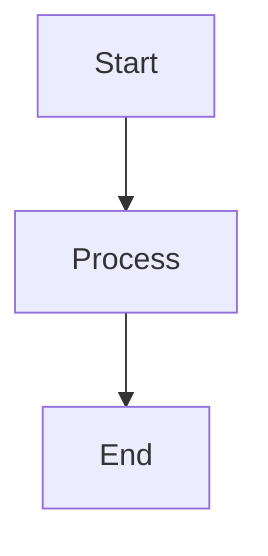

# Whitepaper Generator

A professional LaTeX whitepaper generator that converts Markdown to beautifully formatted PDFs with full Mermaid diagram support.

## Features

- ✅ **Dynamic LaTeX Template** - Fully customizable via YAML frontmatter
- ✅ **Mermaid Diagram Support** - Automatic conversion to high-quality PNG images
- ✅ **Professional Typography** - Palatino serif font, proper spacing, smart layouts
- ✅ **Responsive Tables** - Full-width tables with proper column formatting
- ✅ **Table of Contents** - Automatic generation with configurable depth
- ✅ **Custom Branding** - Configurable colors, headers, taglines
- ✅ **Clean Output** - Automatic cleanup of auxiliary LaTeX files

## Quick Start

### Prerequisites

```bash
# macOS with Homebrew
brew install pandoc python3 node

# Install LaTeX distribution
brew install --cask basictex

# Install required packages
sudo tlmgr update --self
sudo tlmgr install titlesec xcolor hyperref booktabs longtable array \
                   tabularx ltablex enumitem mathpazo helvet setspace \
                   etoolbox oberdiek

# Install mermaid-cli
npm install -g @mermaid-js/mermaid-cli
```

### Installation

```bash
# Clone the repository
git clone https://github.com/yourusername/whitepaper-generator.git
cd whitepaper-generator

# Make scripts executable
chmod +x build_whitepaper.sh process_mermaid.py
```

### Basic Usage

```bash
# Create a markdown file with YAML frontmatter
cat > my_document.md << 'EOF'
---
title: "My Awesome Whitepaper"
author: "Your Name"
date: 2025-11-06
version: "1.0"
---

# Introduction

Your content here...
EOF

# Build the PDF
INPUT_MD="my_document.md" ./build_whitepaper.sh
```

## Documentation

### YAML Frontmatter Options

Configure your document with YAML frontmatter:

```yaml
---
# Required
title: "Your Document Title"
author: "Author Name"
date: 2025-11-06

# Optional - Metadata
subtitle: "Optional Subtitle"
version: "1.0"
organization: "Company Name"
audience: "Target Audience"

# Optional - Customization
header-left: "Short Header Text"
tagline: "A concise description"
subject: "PDF subject metadata"
keywords: "keyword1, keyword2, keyword3"

# Optional - Branding (hex colors without #)
primary-color: "003366"
secondary-color: "555555"
---
```

### Mermaid Diagrams

Include diagrams directly in your markdown:

````markdown

````

The build script automatically:
1. Extracts mermaid blocks
2. Renders them as PNG images
3. Replaces blocks with image references
4. Includes images in the final PDF

### Environment Variables

Override default filenames:

```bash
INPUT_MD="custom.md" \
OUTPUT_PDF="report.pdf" \
TEMPLATE_TEX="custom_template.tex" \
./build_whitepaper.sh
```

## Examples

### Corporate Report

```yaml
---
title: "Q4 2025 Strategic Review"
subtitle: "Performance Analysis & Future Outlook"
version: "3.2"
author: "Jane Smith, VP Strategy"
date: 2025-11-06
organization: "Acme Corporation"
audience: "Board of Directors, Executive Team"
primary-color: "1a472a"
secondary-color: "4a4a4a"
---
```

### Technical Whitepaper

```yaml
---
title: "Machine Learning Infrastructure at Scale"
author: "Engineering Team"
date: 2025-11-06
header-left: "ML Infrastructure Whitepaper"
primary-color: "0066cc"
secondary-color: "666666"
subject: "Technical Architecture"
keywords: "machine learning, infrastructure, scalability"
---
```

### Research Paper

```yaml
---
title: "AI Collaboration Effectiveness"
subtitle: "A Behavioral Measurement Framework"
version: "2.1"
author: "Dr. Sarah Chen"
date: 2025-11-06
organization: "Research Institute"
tagline: "Quantifying human-AI collaboration quality"
---
```

## Project Structure

```
whitepaper-generator/
├── build_whitepaper.sh      # Main build script
├── process_mermaid.py        # Mermaid diagram pre-processor
├── whitepaper_template.tex   # LaTeX template
├── README.md                 # This file
├── LICENSE                   # MIT License
├── .gitignore               # Git ignore rules
└── examples/                 # Example documents
    ├── corporate_report.md
    ├── technical_whitepaper.md
    └── research_paper.md
```

## How It Works

```
1. Markdown Input
   ↓
2. process_mermaid.py (extracts & renders diagrams)
   ↓
3. Pandoc (converts to LaTeX)
   ↓
4. pdflatex (compiles to PDF, 2 passes)
   ↓
5. Final PDF Output
```

## Customization

### Modify the Template

Edit `whitepaper_template.tex` to customize:
- Font families
- Page geometry
- Section formatting
- Color schemes
- Header/footer styles

### Adjust Mermaid Rendering

Edit `process_mermaid.py` to change:
- Image size: Line 67 `width=80%`
- Background: Line 35 `-b transparent`
- Output format: Change `.png` to `.svg`

## Troubleshooting

### "command not found: pandoc"
Install pandoc: `brew install pandoc`

### "command not found: pdflatex"
Install BasicTeX: `brew install --cask basictex`

### "command not found: mmdc"
Install mermaid-cli: `npm install -g @mermaid-js/mermaid-cli`

### "File `titlesec.sty' not found"
Install missing LaTeX packages:
```bash
sudo tlmgr install titlesec xcolor hyperref booktabs longtable \
                   array tabularx ltablex enumitem
```

### Tables render too narrow
Check that your template includes `tabularx` and `ltablex` packages.

### Mermaid diagrams don't render
1. Verify mmdc is installed: `mmdc --version`
2. Test mermaid syntax at https://mermaid.live/
3. Check Python 3 is available: `python3 --version`

## Contributing

Contributions are welcome! Please:

1. Fork the repository
2. Create a feature branch (`git checkout -b feature/amazing-feature`)
3. Commit your changes (`git commit -m 'Add amazing feature'`)
4. Push to the branch (`git push origin feature/amazing-feature`)
5. Open a Pull Request

## License

This project is licensed under the MIT License - see the [LICENSE](LICENSE) file for details.

## Acknowledgments

- Built with [Pandoc](https://pandoc.org/)
- Mermaid diagrams via [mermaid-cli](https://github.com/mermaid-js/mermaid-cli)
- LaTeX distribution via [TeX Live](https://www.tug.org/texlive/)

## Author

Created by Sam Rogers for the PAICE.work project.

## Support

- 📧 Email: support@paice.work
- 🐛 Issues: [GitHub Issues](https://github.com/yourusername/whitepaper-generator/issues)
- 💬 Discussions: [GitHub Discussions](https://github.com/yourusername/whitepaper-generator/discussions)

---

**Star ⭐ this repo if you find it useful!**
