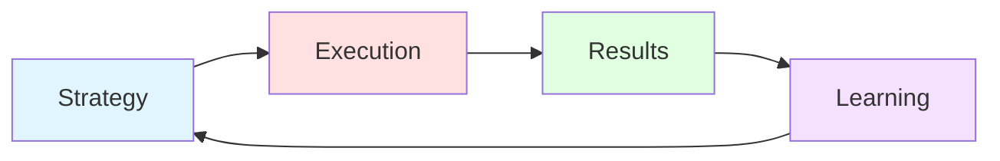
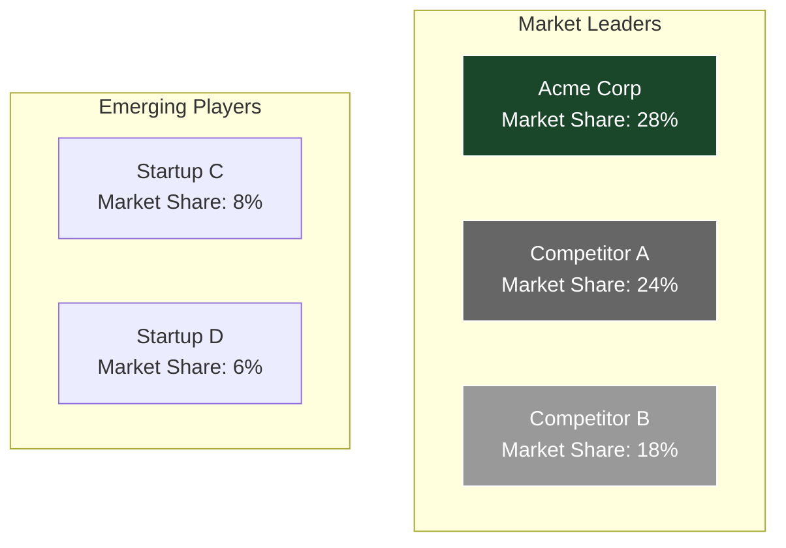

# Executive Summary

This quarterly review presents our strategic performance for Q4 2025, highlighting key achievements, challenges, and strategic priorities for 2026.

**Key Highlights:**
- Revenue growth of 23% YoY
- Market share expansion in key segments
- Successful product launch initiatives
- Strong operational efficiency gains

---

## Financial Performance

### Revenue Breakdown

| Quarter | Revenue ($M) | Growth (%) | Margin (%) |
|---------|--------------|------------|------------|
| Q1 2025 | 145.2        | 15%        | 32%        |
| Q2 2025 | 156.8        | 18%        | 34%        |
| Q3 2025 | 168.4        | 21%        | 35%        |
| Q4 2025 | 178.9        | 23%        | 36%        |

### Strategic Performance Flow

---

## Strategic Initiatives

### Initiative 1: Market Expansion

**Objective:** Increase market presence in North American and European markets

**Results:**
- Opened 5 new regional offices
- Hired 45 sales representatives
- Acquired 120 new enterprise customers

**ROI:** 3.2x investment return

### Initiative 2: Product Innovation

**Objective:** Launch next-generation platform

**Results:**
- Beta program with 500+ users
- 95% satisfaction rating
- 30% feature adoption increase

**Status:** ✅ Launched successfully in November

---

## Market Analysis

### Competitive Positioning

### Key Trends

1. **Digital Transformation:** 78% of enterprises accelerating cloud adoption
2. **AI Integration:** 65% planning AI investments in 2026
3. **Sustainability:** ESG considerations in 82% of procurement decisions

---

## 2026 Strategic Priorities

### Priority Matrix

| Priority | Impact | Effort | Timeline |
|----------|--------|--------|----------|
| Platform V2 Launch | High | High | Q1 2026 |
| European Expansion | High | Medium | Q2 2026 |
| AI Capabilities | Medium | High | Q3 2026 |
| Customer Success | High | Low | Ongoing |

### Investment Allocation

- Product Development: 40%
- Sales & Marketing: 30%
- Operations: 20%
- R&D: 10%

---

## Risk Assessment

| Risk | Probability | Impact | Mitigation |
|------|-------------|--------|------------|
| Market saturation | Medium | High | Diversification strategy |
| Regulatory changes | Low | High | Compliance framework |
| Talent retention | High | Medium | Enhanced benefits package |
| Supply chain | Medium | Medium | Multi-vendor approach |

---

## Recommendations

1. **Accelerate European expansion** to capitalize on strong market demand
2. **Double down on AI capabilities** to maintain competitive advantage
3. **Strengthen customer success** to improve retention and expansion
4. **Invest in talent development** to support growth trajectory

---

## Conclusion

Q4 2025 demonstrated strong execution across strategic priorities. Our focus for 2026 remains on sustainable growth, operational excellence, and continued innovation.

**Next Board Meeting:** January 15, 2026

---

**Prepared by:** Strategy Team  
**Date:** November 6, 2025  
**Classification:** Board Confidential
