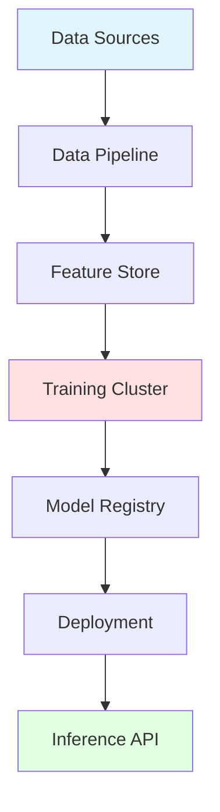
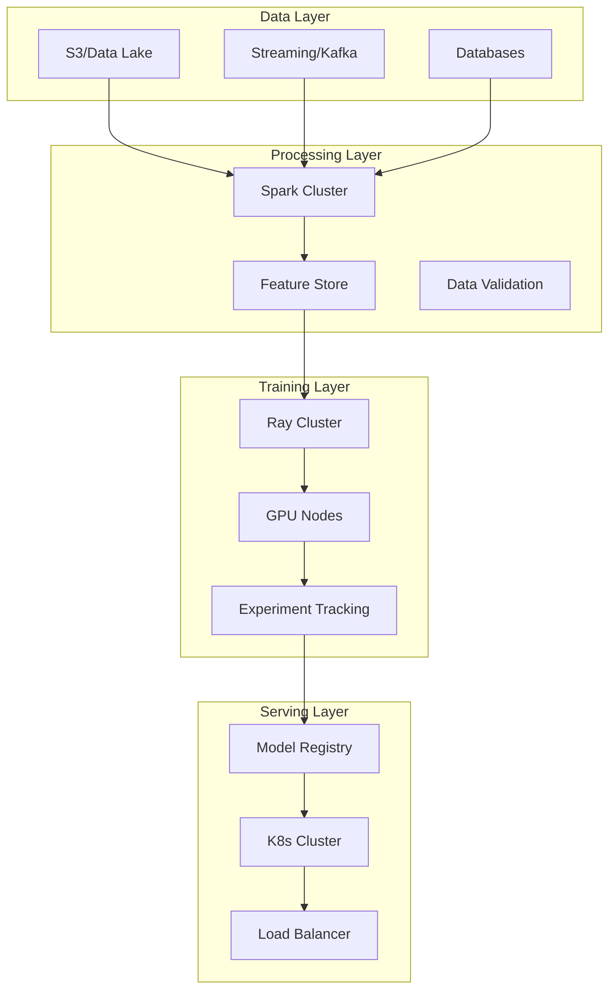
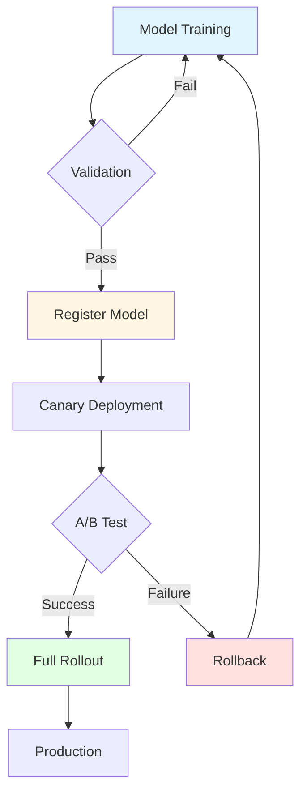
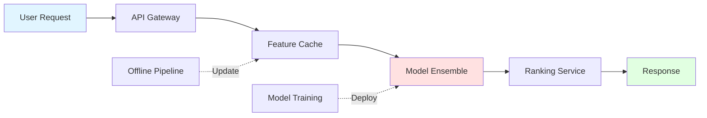

# Abstract

This whitepaper presents architectural patterns and best practices for building distributed machine learning infrastructure that scales to production workloads. We cover data pipelines, model training orchestration, and deployment strategies based on real-world implementations.

**Target Audience:** ML Engineers, Platform Engineers, Technical Architects

---

## Introduction

### The Challenge

Modern machine learning models require:
- Petabytes of training data
- Distributed compute across GPU clusters
- Complex orchestration and monitoring
- Reliable deployment pipelines

Traditional monolithic approaches don't scale.

### Our Approach



---

## System Architecture

### High-Level Components

| Component | Technology | Purpose |
|-----------|------------|---------|
| Data Pipeline | Apache Spark | ETL and preprocessing |
| Feature Store | Feast | Feature management |
| Training | Ray + PyTorch | Distributed training |
| Registry | MLflow | Model versioning |
| Deployment | Kubernetes | Container orchestration |
| Serving | TorchServe | Model inference |

### Architecture Diagram



---

## Data Pipeline Design

### Pipeline Stages

1. **Ingestion:** Collect raw data from multiple sources
2. **Validation:** Schema checks and quality gates
3. **Transformation:** Feature engineering and normalization
4. **Storage:** Write to feature store

### Example Pipeline Code

```python
from pyspark.sql import SparkSession

spark = SparkSession.builder \
    .appName("MLDataPipeline") \
    .getOrCreate()

# Read raw data
df = spark.read.parquet("s3://data-lake/raw/events/")

# Transform
features = df.select(
    "user_id",
    "timestamp",
    F.avg("engagement_score").over(window).alias("avg_engagement")
)

# Write to feature store
features.write.mode("append") \
    .format("feast") \
    .save("user_features")
```

---

## Distributed Training

### Training Infrastructure

| Metric | Specification |
|--------|---------------|
| GPU Nodes | 32x A100 80GB |
| CPU Cores | 2048 cores |
| Memory | 16TB RAM |
| Storage | 500TB NVMe |
| Network | 400Gbps InfiniBand |

### Scaling Strategy


### Performance Optimization

**Techniques employed:**
- Gradient accumulation for larger batch sizes
- Mixed precision training (FP16)
- Gradient checkpointing for memory efficiency
- Pipeline parallelism for large models

**Results:**
- 4.5x training speedup vs. single GPU
- 87% GPU utilization
- 2.3x throughput improvement

---

## Model Deployment

### Deployment Pipeline



### Deployment Strategies

| Strategy | Use Case | Risk | Speed |
|----------|----------|------|-------|
| Blue-Green | Critical models | Low | Medium |
| Canary | A/B testing | Medium | Fast |
| Rolling | Updates | Low | Slow |
| Shadow | Validation | Very Low | N/A |

---

## Monitoring & Observability

### Key Metrics

**Training Metrics:**
- Loss convergence
- Learning rate schedule
- Gradient norms
- GPU utilization

**Serving Metrics:**
- Latency (p50, p95, p99)
- Throughput (requests/sec)
- Error rates
- Model drift

### Alert Thresholds

```python
alerts = {
    "p99_latency": {"threshold": 500, "unit": "ms"},
    "error_rate": {"threshold": 0.01, "unit": "percentage"},
    "drift_score": {"threshold": 0.15, "unit": "KL_divergence"}
}
```

---

## Best Practices

### Data Management

1. **Version everything:** Data, code, configs, models
2. **Validate early:** Schema checks at ingestion
3. **Monitor drift:** Detect distribution shifts
4. **Secure PII:** Encrypt sensitive data

### Training

1. **Reproducibility:** Pin dependencies, set seeds
2. **Experiment tracking:** Log all hyperparameters
3. **Checkpointing:** Save frequently during training
4. **Resource limits:** Set GPU memory caps

### Deployment

1. **Gradual rollout:** Start with small traffic %
2. **Circuit breakers:** Fail fast on errors
3. **Rollback plan:** Automate reversion
4. **Load testing:** Validate under stress

---

## Case Study: Real-Time Recommendations

### Problem Statement

Build a recommendation system serving 10M+ users with <50ms latency.

### Solution Architecture



### Results

| Metric | Before | After | Improvement |
|--------|--------|-------|-------------|
| Latency (p99) | 850ms | 42ms | 95% ↓ |
| Throughput | 5K QPS | 45K QPS | 9x ↑ |
| CTR | 2.3% | 4.7% | 104% ↑ |
| Cost/1M requests | $12 | $3 | 75% ↓ |

---

## Future Directions

### Roadmap

**Q1 2026:**
- Multi-region deployment
- Advanced AutoML capabilities
- Cost optimization toolkit

**Q2 2026:**
- Federated learning support
- Edge deployment framework
- Enhanced monitoring dashboard

**Q3 2026:**
- LLM fine-tuning pipeline
- Automated hyperparameter tuning
- Multi-modal model support

---

## Conclusion

Building production ML infrastructure requires careful consideration of data pipelines, training orchestration, and deployment strategies. Our architecture has proven capable of scaling to enterprise workloads while maintaining reliability and cost efficiency.

**Key Takeaways:**
1. Invest in robust data infrastructure early
2. Automate everything that can be automated
3. Monitor continuously and act on signals
4. Design for failure and plan rollback strategies

---

## References

1. Dean, J. et al. (2012). "Large Scale Distributed Deep Networks"
2. Moritz, P. et al. (2018). "Ray: A Distributed Framework for Emerging AI Applications"
3. Sculley, D. et al. (2015). "Hidden Technical Debt in Machine Learning Systems"

---

## Appendix A: Hardware Specifications

### GPU Cluster Configuration

- **GPU:** NVIDIA A100 80GB
- **CPU:** AMD EPYC 7763 (64 cores)
- **RAM:** 512GB DDR4-3200
- **Storage:** 8TB NVMe SSD (Gen4)
- **Network:** Mellanox ConnectX-6 (200Gbps)

### Software Stack

- **OS:** Ubuntu 22.04 LTS
- **Container:** Docker 24.0 + Kubernetes 1.28
- **ML Frameworks:** PyTorch 2.1, TensorFlow 2.15
- **Orchestration:** Ray 2.8, Kubeflow 1.8

---

**Document Version:** 2.0  
**Last Updated:** November 6, 2025  
**Contact:** ml-infrastructure@techcorp.com
